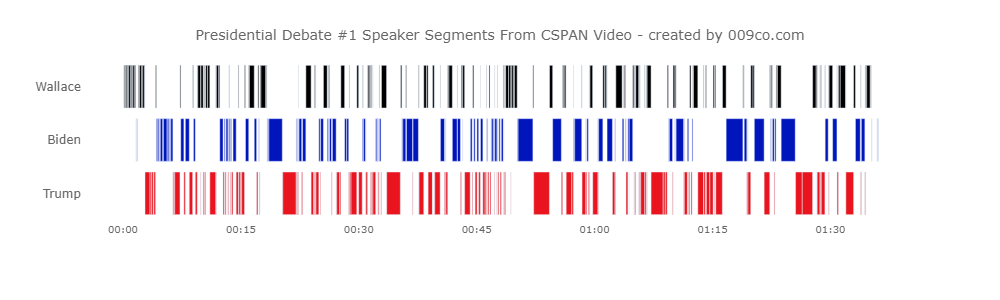

# 2020 Presidential Debate #1 Speaker Segments - Using Amazon Transcribe

Amazon Transcribe was used to create a transcription of the 2020 Presidential Debate #1 audio. The transcription contains "segments" for each identified speaker in the audio. These segments have start and end times. Amazon Transcribe seems to be pretty good at identifying the speakers in the audio.

## Retrieving debate audio

Debate audio was retrieved from this CSPAN <a href="https://www.youtube.com/watch?v=wW1lY5jFNcQ">YouTube video</a> using youtube-dl.

<a href="https://youtube-dl.org">youtube-dl</a> is a command-line program to download videos from YouTube.com. The audio was retrieved using youtube-dl with the following command:

youtube-dl -x --audio-format "mp3" "https://www.youtube.com/watch?v=wW1lY5jFNcQ"

In addition, Libav https://libav.org 'avconv' was used to remove the YouTube audio first 30 minutes or so where debate has not yet started. 

avconv -ss 00:27:45 -t 02:03:00 -i debate_audio.mp3 -vcodec libx264 debate_audio_shorter.mp3

## Transcribing debate audio

Amazon Transcribe requires the audio file to be in an S3 bucket. The mp3 file was uploaded to an S3 bucket and Amazon Transcribe used to transcribe it. Both were done using Python and AWS Boto3 SDK.

The transcription process outputs a JSON file into the S3 bucket. The JSON file contains the following:

* Text transcription - text of audio transcription.
* Speaker segments - one or more time based segments by speaker.  
* Segment items - one or more time based "items" (each a single word) by speaker.

## Processing debate output JSON

Python used to load JSON file into Pandas dataframe that was used as data source for a Plotly timeline chart.

Plotly timeline charts require datetimes for period start and end and x-axis values. A fake date was created by adding arbitrary date (1970-01-01) to an "HH:mm:ss" value created from the segment start_time and end_time seconds values.

